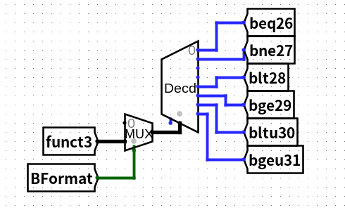
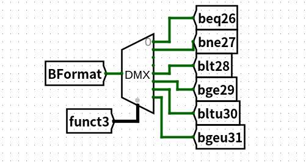
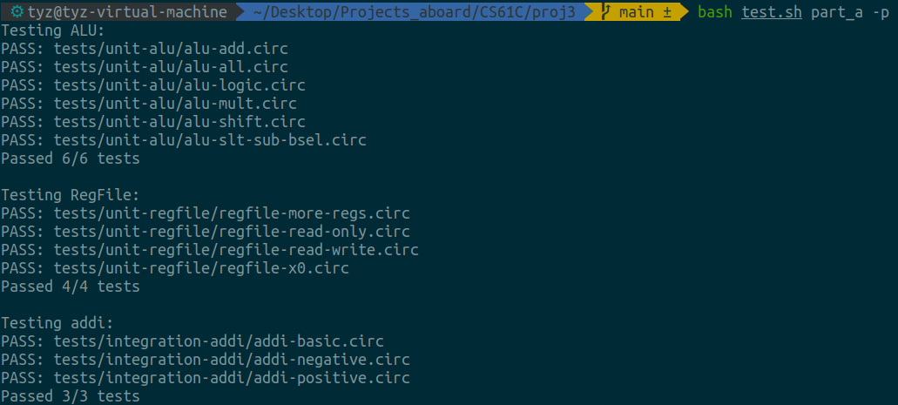
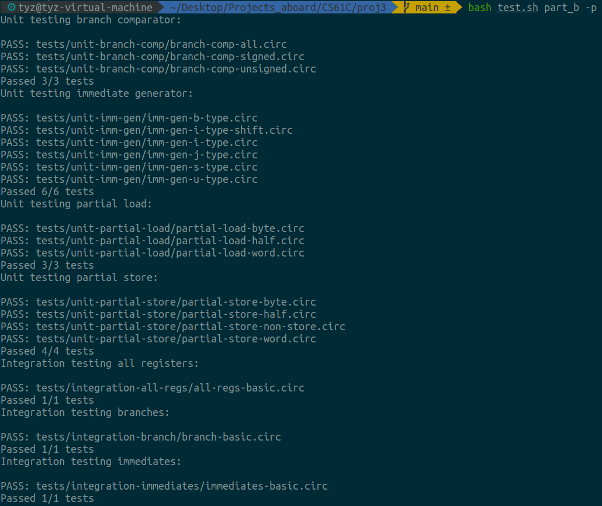
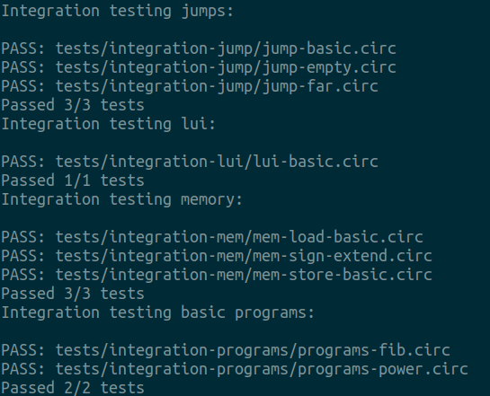
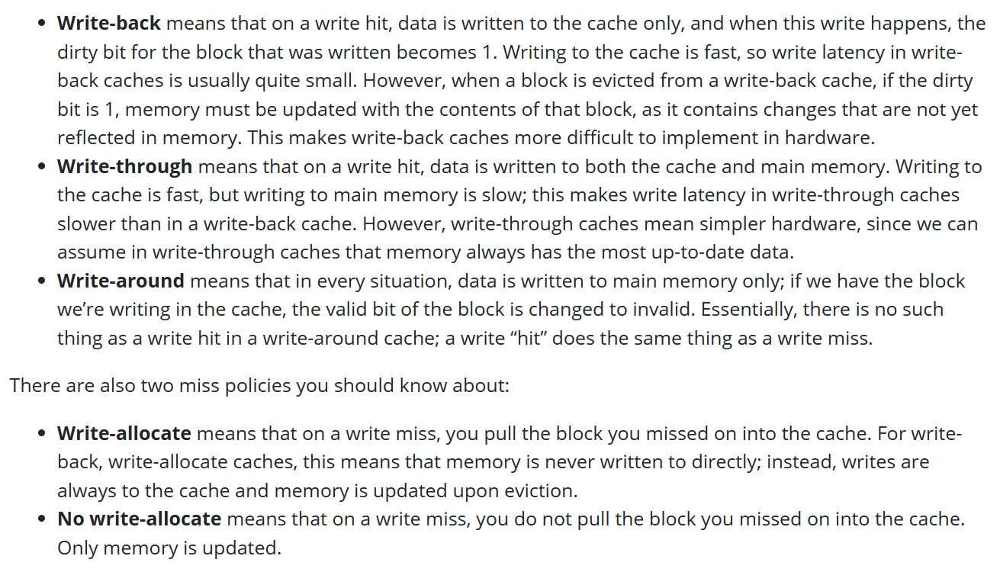

# CS61C

### Lab 01

- `scp <source> <destination>`

使用 ssh 进行复制

- 使用 cgdb

**《gdb高级调试教程》**

由于使用 cgdb 自带了窗口，所以 list 就不必要了。

| 命令          | 效果                                             |
| ------------- | ------------------------------------------------ |
| r             | 运行至下一个断点                                 |
| b+行号/函数名 | 添加断点                                         |
| info b        |                                                  |
| bt            | 查看当前线程堆栈                                 |
| c             | 继续运行                                         |
| finish        | 直接执行完当前函数返回                           |
| n             | 单步步过（不进入函数）                           |
| s             | 单步步入                                         |
| display       | 每次暂停，打印监视的变量的值（info/del display） |
| print         |                                                  |

其中 info 有很多组合

- info locals
- info functions
- info args

- 详见 help info

### lab 03

- la指令是什么

给一个寄存器赋予一个标签的地址

[详解risc-v的la指令 - 知乎 (zhihu.com)](https://zhuanlan.zhihu.com/p/367085156)

- li

同 la 都是伪指令

- ret (jalr x0, ra)

[RISC-V汇编语言入门（六） —RV32I指令集 - 知乎 (zhihu.com)](https://zhuanlan.zhihu.com/p/540887151)

### lab 04

- 对于 t 类寄存器，我们如果想在调用函数后继续使用，必须将其保证在栈中
- 对于 s 类寄存器，我们可以直接在调用函数后继续使用，因为其在调用的函数中**将会被还原**（如果使用）

### proj 2

项目要求我们用汇编实现一个简单的线性神经网络，项目难度并不高，写完之后对 RISC-V 汇编更加熟悉了。在感受到汇编无与伦比的灵活性时，也不禁怀念起了高级语言。

- **对于 a 类寄存器，可以在开头用 s 类寄存器缓存起来，这样就不用频繁入栈出栈了**
- 寄存器没有地址，CPU 内部靠编号取值
- 空间的使用非常灵活，比如：可以为每一个矩阵多申请 4 字节来存放元素数量
- 官方在 `util.s` 封装了一层 ecall 调用，让使用系统调用的时候更方便了
- 写到这里基本已经熟悉了汇编的写法，所以并未遇到太多难点

### lab 05, 06

- 模拟电路，非常有意思
- 再次认识到了 truth table, 布尔代数的转换的重要性
- 认识了更多的器件，比如: splitter, extender 等等，器件的使用非常灵活，可玩性很高

#### proj3

- 但凡涉及电路，做的都是 23 版的。
- 碰到不懂的元器件，直接 help->library references
- 做 register file 的时候因为都是 32 位的，所以来回打了好久。快做到最后才发现可以多选器件同时设置，比如可以多选 tunnel，一次性全部设置成 1 bit
- Combinational Logic 是最难的部分。为了指令的严谨性，对所有的位都使用了 comparator，比如 opcode funct3 已经唯一确定了一条指令，但还是对 funct7 进行验证。否则将出现一条不满足指令格式的指令被执行。
- 一种方法是对每个字段制作 tunnel，随后通过大量的 AND GATE 连接。~另一种是是使用器件比如 decoder, demultiplexer 等连接。我的是将二者结合，对 funct3 字段使用 decoder，对 funct7 字段使用 tunnel。原因是 funct3 8个值往往会取6个以上，而 funct7 总共只有3个值，使用 decoder 是浪费。

设计的时候注意未知状态



可以看到如果 Bformat 为 0 时，那些标签是没有输入的，最终将导致 ROMInput 处于未知状态。正确的设计如下



- 对于计算，更正确的做法应该是由类似 decoder 的器件决定要干什么，然后再进行计算。而不是先都算完，再由 multiplexer 决定。
- 做的时候还发现课件写错了，jal 的时候 ASel应该为1
- 对于这个二阶段流水线，我们需要保存 instruction 和 PC
- 对于 control hazard，当发现 PCSel 为1时，说明同一时间的 IF 阶段需要插入一个 no-op 了
- 写错一个标签 17 写成 117，查了一个小时。







### lab 07

- 这部分主要是为了帮助我们深刻理解 Cache
- 这部分开头帮我们再次理清了概念
  - write-back: 在数据更新时只写入缓存Cache。只在数据被替换出缓存时，被修改的缓存数据才会被写到后端存储（即先把数据写到Cache中，再通过flush方式写入到内存中）。此模式的优点是数据写入速度快，因为不需要写存储；缺点是一旦更新后的数据未被写入存储时出现系统掉电的情况，数据将无法找回。         
  -  
  - 直写就是不管什么样都写两份，写回就是只写高速缓存，仅当页面被换出时写回 Memory。
  - Write-allocate: 当写页面丢失时，将内存拿到 Cache 中再写
  - No Write-allocate: 写的时候不拿到 Cache 中，而是直接向内存中写。只有读数据会被缓存
  - 显然，Write-back 配合 Write-allocate；Write-through 配合 No Write-allocate

- 矩阵乘法的示例非常经典
- 分块转置给人很深的印象：仅仅多加了两个循环却使速度上升了非常多。这给人以思考，在**日常的使用中要重视高速缓存的作用**

### lab08

跳

### lab09

- 学习使用一些简单的 SIMD 函数来加速向量加法

- 实验中提到：循环展开可以减少浪费的 cycle，是因为从汇编角度看，每一次循环的最后分支预测都是错误的，而循环展开使循环次数减小了，也就减少了浪费。

- 最后的结果

- ```shell
  Let's generate a randomized array.
  Starting randomized sum.
  Time taken: 6.050769 s
  Sum: 103161741312
  Starting randomized unrolled sum.
  Time taken: 4.112006 s
  Sum: 103161741312
  Starting randomized SIMD sum.
  Time taken: 1.344998 s
  Sum: 103161741312
  Starting randomized SIMD unrolled sum.
  Time taken: 1.225852 s
  Sum: 103161741312
  All tests Passed! Correct values were produced, and speedups were achieved!
  ```


### lab 10

- 非常简单的 OpenMP 的使用
- 多进程因为之前学过所以跳过了

### proj4

- 比较简单的 c ，跳过了
